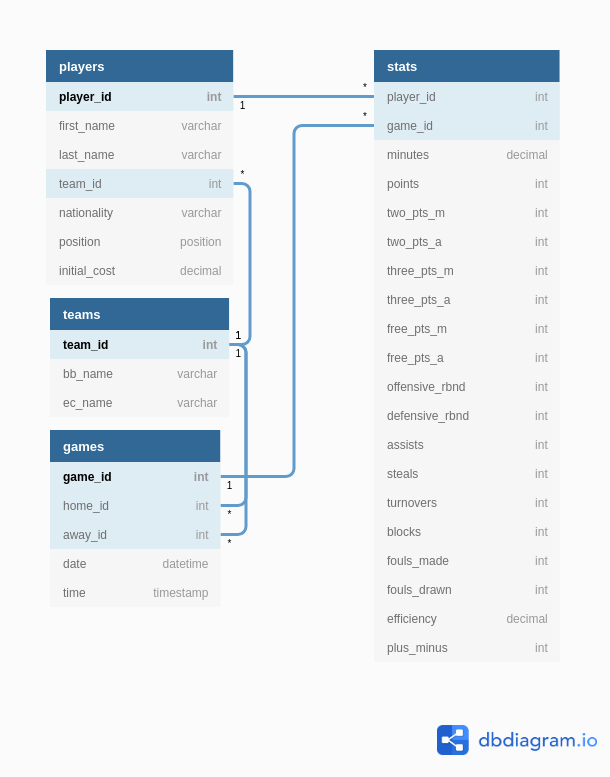

# BBL Manager

## Components

### Basketball.de
https://basketball.de/app/bblmanager

Username: SKings0
Password: p4ssw0rd

1. Scrape all the information of all players in the league and store to 
   database. (Homepage -> Spieler)
2. Scrape all the information of all managers in a division for a given
   division url, e.g. https://basketball.de/app/buli_beko/division/41-Sebas-Co
3. Scrape all the information of all managers in the game. (Homepage -> Rangliste)

### easycredit BBL
1. Scrape all games in the main season. Date and time for some games may not be
   set yet.
   https://www.easycredit-bbl.de/de/saison/spielplan/alle-spiele/
2. Scrape information for each player for each game. Example:
   https://www.easycredit-bbl.de/de/statistiken/spieler/portraits/p/45631-terry-allen/

